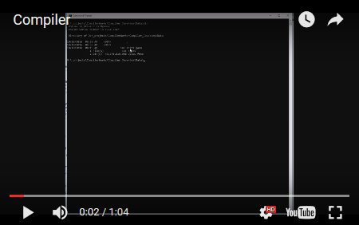

# CompilerWorks

 <i>Demonstration of each step of the compiler</i>

<h2>Description</h2>

After working with my third student on compiler development, I decided to engineer a compiler myself.  This is a Java compiler written <i>in</i> Java.  The goal is to implement all aspects of the modern Java spec (up to version 7).
  
The compiler is currently extremely limited, but I'm making a lot of progress.  Each step has been implemented to some capacity and exists as its own project:
<ul>
<li><b>Tokenizer</b> - Breaks the source code into a list of words and symbols recognized by Java.</li>
<li><b>Parser</b> - Builds Java 'sentences' from the tokenizer's output.  Output includes: methods, for loops, expressions.</li>
<li><b>Processor</b> - Handles type checking of parser output.  Also some minimal rewrite of parser output.</li>
<li><b>Generator</b> - Generates JVM assembly language from processor output.</li>
<li><b>Assembly</b> - Builds class files of machine code from generator output.</li>
</ul>

<h2>Challenges</h2>

The biggest challenge so far has been in type checking.  Type checking required that I implement a database for the classpath (class members are lazy-loaded from class files in both directories and jar files).  Type checking also required modeling nested scope and mapping local variables to stack positions.
  
Another challenge was to develop a JVM bytecode assembler.  This was the first system I completed in this project.  I've since used this assembler as a tutoring aid on multiple occasions.

